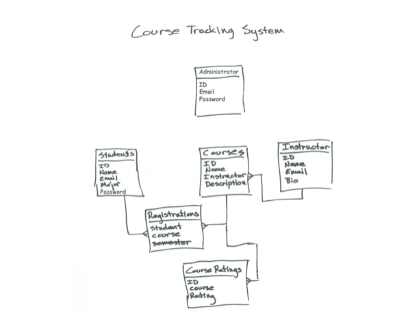

# Course Tracking System
A node.js REST API made on Loopback and MongoDB as part of an exercise.

## Author
Juan Carlos Sanchez Cruz

## Run this Project
### Installing
```
git clone https://github.com/Juanca17/coursetrack.git
cd coursetrack
npm start
```

### Run the api explorer
```
node .
```
Browse the REST API at http://localhost:3000/explorer

## Data Model


## Built With
The project is generated by [LoopBack](http://loopback.io).
